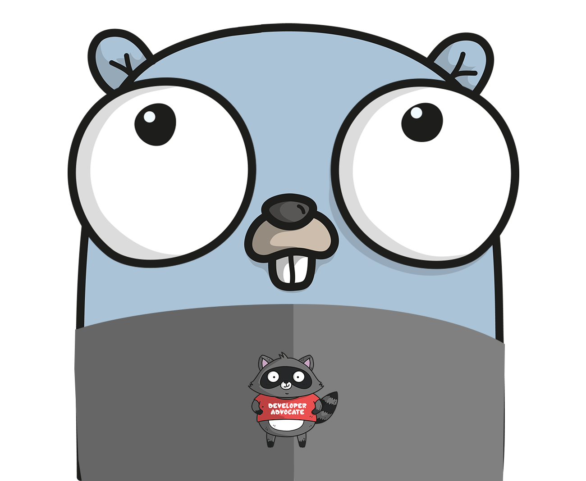

# AVL Tree Binary Search Tree for  Go
[](https://circleci.com/gh/jrpalma/avl)
[](https://godoc.org/github.com/jrpalma/avl)
[](https://goreportcard.com/report/github.com/jrpalma/avl)


# Table of Contents
- [Documentation](#documenation)
- [Overview](#Overview)
- [Installing](#Installing)
- [Concepts](#Concetps)
  * [Interface](#interface)
  * [Operations](#operations)
  * [Traversing](#traversing)
- [Contributing](#contributing)

# Documentation
You can find the package documentation at https://pkg.go.dev/github.com/jrpalma/arg

# Overview
AVL is a Go package used to insert, search, and delete in O(log n). The package also has the ability traverse the AVL tree in ascending and descending order. The AVL API is relatively simple and can be used quickly.

# Installing
You can install avl under your GOPATH if your version of Go does not support modules. Run the following command to install avl under
your GOPATH:
```sh
go get github.com/jrpalma/avl
```
AVL also support Go modules. All you have to do is initialize your project and import avl into your project. If your project has not been initialized, all you have to do is 
run the following command under your project:
```sh
# You will have to specify <project path>
# if you are outside your GOPATH
go mod init <project path>
```

# Concepts
An [AVL Tree](https://en.wikipedia.org/wiki/AVL_tree) is a data structure that can insert, search, and delete in O(log n). The package provides the ability to insert, search, and delete by using the Put, Get, and Del methods respectively. Because Go does not support generics at this time, AVL uses the Key interface and type assertion to insert, search, and delete.

## Interface
AVL uses the Key interface to be able to properly balance the tree. In order to insert, search, and delete records, the record must implement the Key interface. The following code describes the Key interface and User record that impelements the Key interface by the user ID.
```go
type Key interface {
	Less(Key) bool
	Equals(Key) bool
}
type User interface {
	ID   uint64
	Name string
	Age  uint8
}
func (u *User) Less(k Key) bool {
	return u.ID < k.(User).ID
}
func (u *User) Equals(k Key) bool {
	return u.ID == k.(User).ID
}
```

## Operations
AVL has the ability to insert, search and delete. The following piece of code makes uses the User struct above to be able to insert, search, and delete by user ID.
```go
cache := &avl.Tree{}
cache.Put(&User{ID: 10, Name: "Joe Smith", Age: 19})
cache.Put(&User{ID: 11, Name: "Bob Palmer", Age: 41})
cache.Put(&User{ID: 12, Name: "Tom McDonals", Age: 27})
user := cache.Get(&User{ID: 10})
if user, ok := user.(*User); ok {
	user.Age = 20
}
user.Del(&User{ID: 12})
```
## Traversing
AVL has the ability to traverse the tree in ascending and descending order. This can be achieved by simply calling the VisitAscending and VisitDescending functions like in the following example.
```go
cache.VisitAscending(func(k Key) {
	fmt.Printf("%+v\n", k.(*User))
})
cache.VisitDescending(func(k Key) {
	fmt.Printf("%+v\n", k.(*User))
})

```
# Contributing
1. Fork it
2. Clone it `git clone https://github.com/user_name/avl && cd avl`)
3. Create your feature branch (`git checkout -b my-new-feature`)
4. Make changes and add them (`git add .`)
5. Commit your changes (`git commit -m 'Add some feature'`)
6. Push to the branch (`git push origin my-new-feature`)
7. Create new pull request
